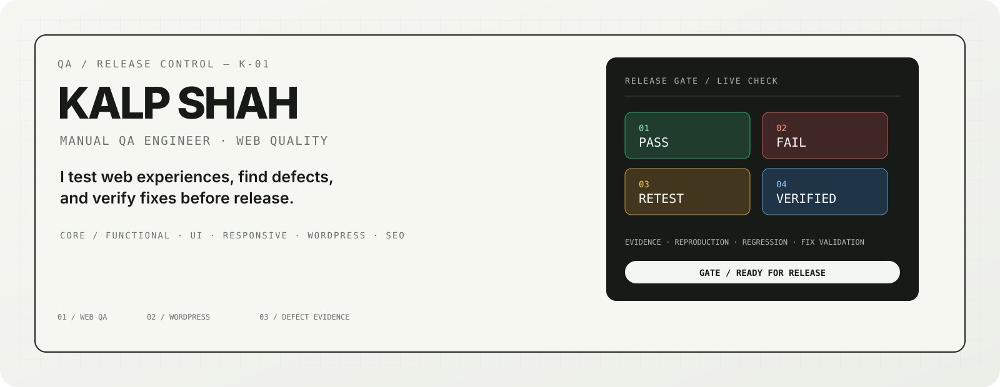

# Kalp Shah — Manual QA Engineer

  <picture>
    <source media="(max-width: 600px)" srcset="./assets/hero/hero-mobile.svg">
    
  </picture>

  <strong>Manual QA · Web · WordPress · UI · Responsive · SEO</strong> 
  I test user journeys, uncover defects, and verify fixes before release.

  <a href="https://kalpshahtester.github.io/">Portfolio</a> ·
  <a href="https://www.linkedin.com/in/kalp-shah-software-tester/">LinkedIn</a> ·
  <a href="https://github.com/kalpshahtester/kalpshahtester.github.io/raw/refs/heads/main/Kalp%20Shah%20Manual%20Tester%20Resume.pdf">Resume</a>

---

## WHAT I DO

**Web quality from first check to verified release.**

Functional workflows · UI consistency · Responsive behavior · WordPress/content QA · SEO/accessibility checks · Defect reporting · Regression · Retesting

---

## SELECTED QA CASE STUDIES

### 01 / SauceDemo

**E-commerce workflow QA**

**47 test scenarios · 62+ test cases · 282 execution results**

Login · Products · Cart · Checkout · Negative testing · Regression

[**Test Cases**](https://github.com/kalpshahtester/Manual-Testing-Project-saucedemo-website/tree/main/04_Test_Cases) · [**Bug Reports**](https://github.com/kalpshahtester/Manual-Testing-Project-saucedemo-website/tree/main/06_Bug_Report) · [**RTM**](https://github.com/kalpshahtester/Manual-Testing-Project-saucedemo-website/tree/main/07_RTM)

### 02 / MakeMyTrip

**Travel booking workflow QA**

Login · Registration · Hotel booking · Flight booking · Validation · Negative testing

[**View project →**](https://github.com/kalpshahtester/MakeMyTrip-Testing-Assessment)

### 03 / WordPress Web QA

**Real-world website quality checks**

Pages · Blogs · Forms · UI · Responsive layouts · Links · Content · SEO · Regression

---

## HOW I TEST

  <picture>
    <source media="(max-width: 600px)" srcset="./assets/process/qa-process-mobile.svg">
    
  </picture>

  <strong>TEST → FIND → REPRODUCE → REPORT → FIX → RETEST → VERIFY</strong>

I work evidence-first: reproduce the issue, document the impact, verify the fix, and regression-check the affected area.

---

## TOOLKIT

**QA:** Manual Testing · Test Cases · Bug Reporting · RTM · Regression · Retesting

**Web:** WordPress · Chrome DevTools · Lighthouse · Responsive Testing

**Workflow:** ClickUp · Slack · Google Sheets · GitHub

**Quality:** SEO · Accessibility Checks · Broken Links · Content Validation · Performance Checks

---

## EXPERIENCE

**Manual QA Engineer**

Web and WordPress testing focused on functional quality, UI consistency, responsive behavior, SEO validation, defect verification and release confidence.

---

## EDUCATION

**Diploma in Information Technology**  
Dr. S. & S. S. Gandhi College of Engineering & Technology

---

## LET'S CONNECT

Interested in web quality, QA collaboration, or testing opportunities?

  <a href="https://kalpshahtester.github.io/">Portfolio</a> ·
  <a href="https://www.linkedin.com/in/kalp-shah-software-tester/">LinkedIn</a> ·
  <a href="https://github.com/kalpshahtester">GitHub</a> ·
  <a href="https://github.com/kalpshahtester/kalpshahtester.github.io/raw/refs/heads/main/Kalp%20Shah%20Manual%20Tester%20Resume.pdf">Resume</a>

  Manual QA Engineer · Web QA · WordPress QA

