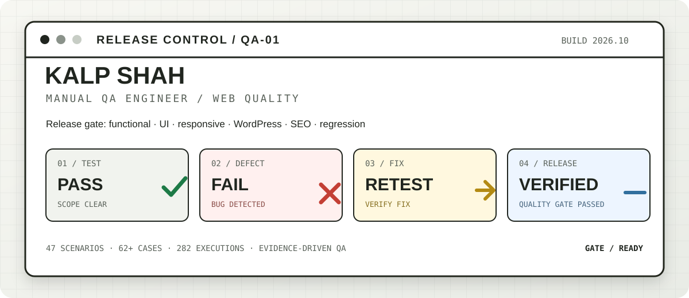
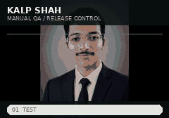
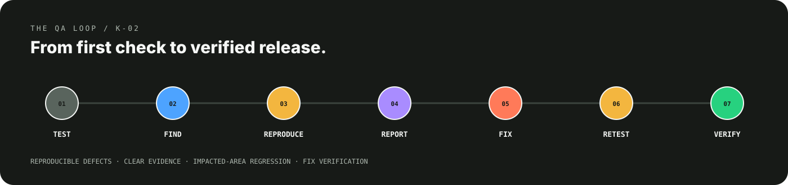
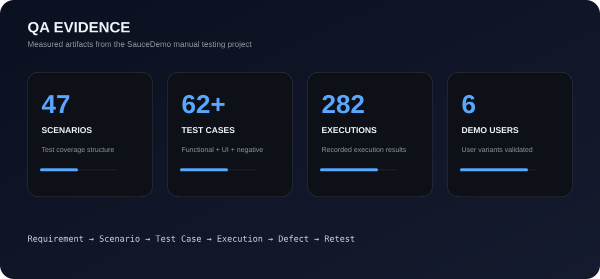

# Kalp Shah — Manual QA Engineer

  <picture>
    <source media="(max-width: 600px)" srcset="./assets/qa-release-control-mobile.svg">
    
  </picture>

<table>
<tr>
<td width="155" align="center" valign="middle">
  
</td>
<td valign="middle">

**MANUAL QA ENGINEER**

**WEB TESTING · WORDPRESS QA · BUG REPORTING · REGRESSION · RELEASE VERIFICATION**

I test real user journeys, uncover defects, document evidence, and verify fixes before release.

FUNCTIONAL QA · UI QA · RESPONSIVE QA · CONTENT/SEO QA

  <a href="https://kalpshahtester.github.io/"><strong>PORTFOLIO →</strong></a>
  &nbsp;&nbsp;·&nbsp;&nbsp;
  <a href="https://www.linkedin.com/in/kalp-shah-software-tester/"><strong>LINKEDIN →</strong></a>
  &nbsp;&nbsp;·&nbsp;&nbsp;
  <a href="https://github.com/kalpshahtester/kalpshahtester.github.io/raw/refs/heads/main/Kalp%20Shah%20Manual%20Tester%20Resume.pdf"><strong>RESUME →</strong></a>

</td>
</tr>
</table>

  <strong>QA RELEASE FLOW</strong> 
  <code>TEST</code> → <code>FIND</code> → <code>REPORT</code> → <code>RETEST</code> → <code>VERIFY</code>

  

---

---

## QA, WITH EVIDENCE

I focus on **finding, reproducing, documenting, and verifying** defects across web experiences.

**Functional QA** · **UI QA** · **Responsive QA** · **WordPress QA** · **Content QA** · **SEO QA** · **Regression**

> **Profile focus:** Manual Testing projects are featured here. Other technical repositories remain available in the account but are intentionally not promoted in this recruiter profile.

---

## SELECTED QA CASE STUDIES

<table>
<tr>
<td width="50%" valign="top">

### 01 / SAUCEDEMO

**E-commerce workflow QA**

**47** test scenarios  
**62+** test cases  
**282** execution results

Login · Products · Cart · Checkout · Negative testing · Regression

[View test cases →](https://github.com/kalpshahtester/Manual-Testing-Project-saucedemo-website/tree/main/04_Test_Cases)

[View bug reports →](https://github.com/kalpshahtester/Manual-Testing-Project-saucedemo-website/tree/main/06_Bug_Report)

</td>
<td width="50%" valign="top">

### 02 / MAKEMYTRIP

**Travel booking workflow QA**

Login · Registration · Hotel booking · Flight booking · Validation · Negative testing

Focus: **workflow coverage, validation, and negative-path testing**

[View project →](https://github.com/kalpshahtester/MakeMyTrip-Testing-Assessment)

[View GitHub repository →](https://github.com/kalpshahtester/MakeMyTrip-Testing-Assessment)

</td>
</tr>
</table>

### 03 / WORDPRESS WEB QA

**Real-world website quality checks**

Pages · Blogs · Forms · UI · Responsive layouts · Links · Content · SEO · Regression

---

## HOW I TEST

  <picture>
    <source media="(max-width: 600px)" srcset="./assets/process/qa-process-mobile.svg">
    
  </picture>

  <strong>TEST → FIND → REPRODUCE → REPORT → FIX → RETEST → VERIFY</strong>

**Evidence-first QA:** reproduce the issue → capture clear evidence → report the impact → retest the fix → regression-check the affected area.

---

## QA EVIDENCE

  

**What I care about:** clear reproduction steps, expected vs actual behavior, useful screenshots, accurate severity/priority, and verified fixes.

---

## TOOLKIT

| QA | Web | Workflow |
|---|---|---|
| Manual Testing | WordPress | ClickUp |
| Test Cases | Chrome DevTools | Slack |
| Bug Reporting | Lighthouse | Google Sheets |
| RTM | Responsive Testing | GitHub |
| Regression | SEO Checks | Documentation |
| Retesting | Accessibility Checks | Evidence Capture |

---

## EXPERIENCE

### Manual QA Engineer

Web and WordPress testing focused on functional quality, UI consistency, responsive behavior, SEO validation, defect verification, regression, and release confidence.

---

## EDUCATION

**Diploma in Information Technology**  
Dr. S. & S. S. Gandhi College of Engineering & Technology

---

## LET'S CONNECT

**Building or improving a web product? I can help test the experience before it reaches users.**

  <a href="https://kalpshahtester.github.io/">Portfolio</a> ·
  <a href="https://www.linkedin.com/in/kalp-shah-software-tester/">LinkedIn</a> ·
  <a href="https://github.com/kalpshahtester">GitHub</a> ·
  <a href="https://github.com/kalpshahtester/kalpshahtester.github.io/raw/refs/heads/main/Kalp%20Shah%20Manual%20Tester%20Resume.pdf">Resume</a>

  MANUAL QA ENGINEER · WEB QA · WORDPRESS QA · RELEASE QUALITY

