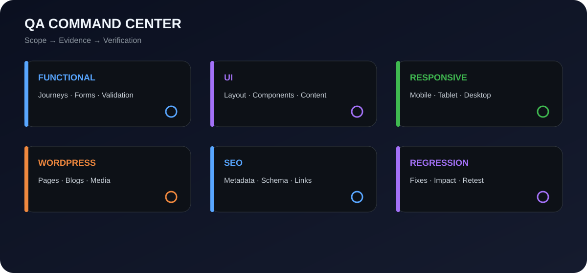
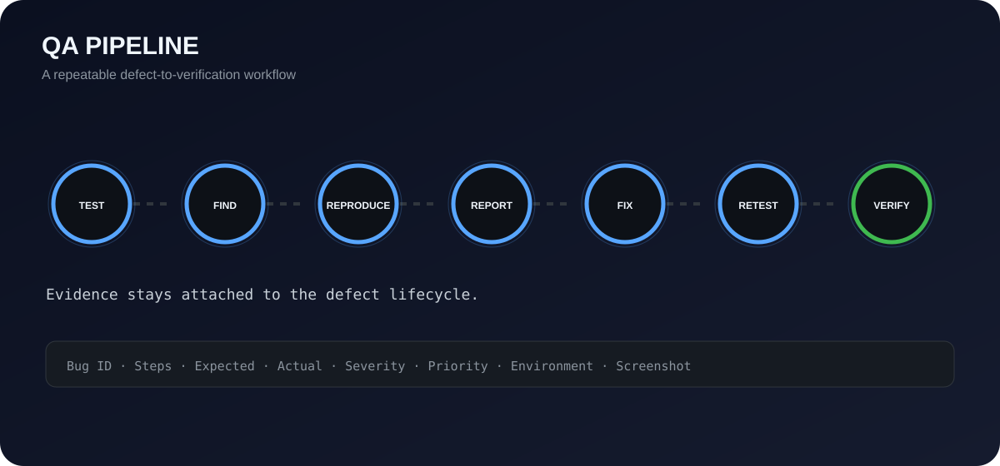
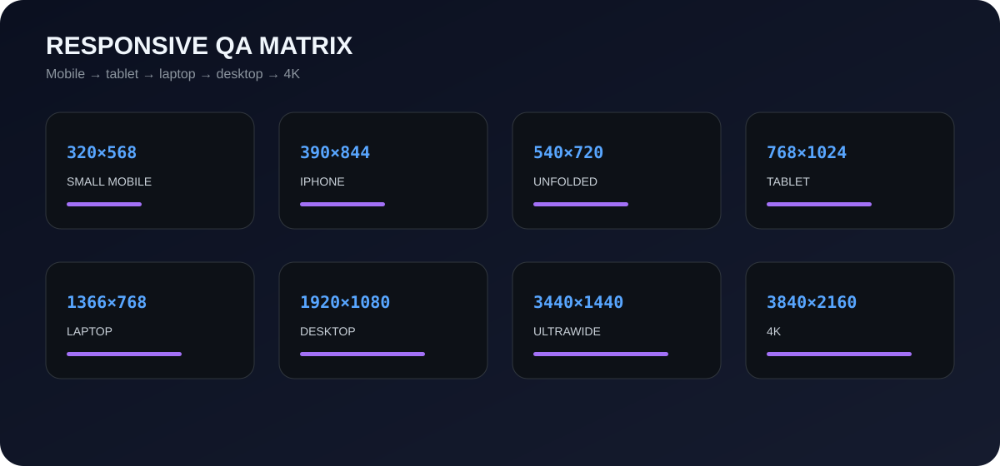
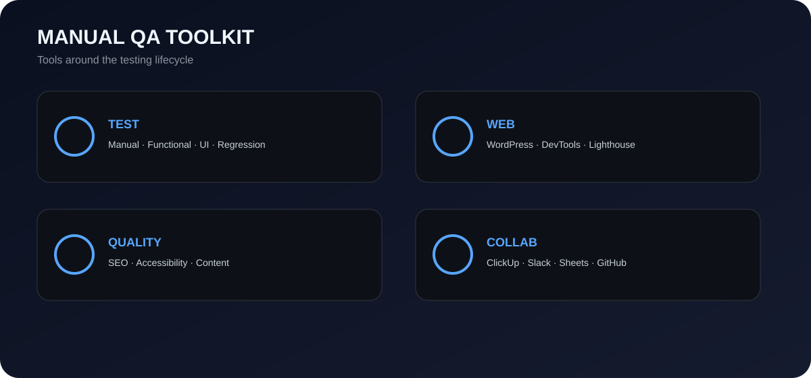
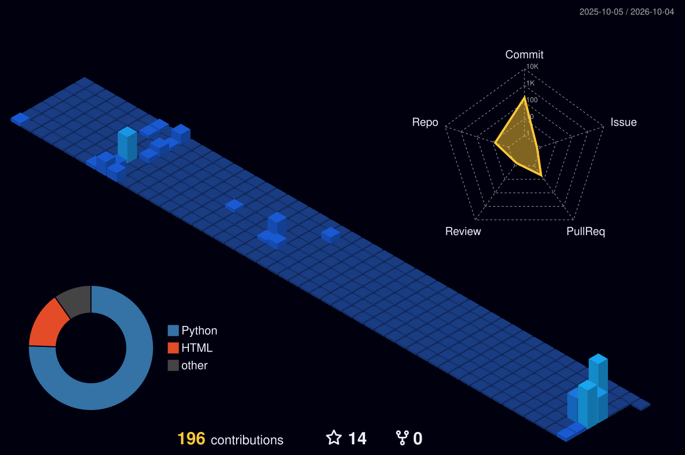

# Kalp Shah — Manual QA Engineer

  <picture>
    <source media="(max-width: 720px)" srcset="./assets/qa-release-control-mobile.svg">
    
  </picture>

  <strong>Finding defects before they reach users.</strong> 
  Manual QA focused on web, WordPress, functional, UI, responsive, SEO and regression testing.

  <strong>QA release gate:</strong> PASS → FAIL → RETEST → VERIFIED

  <a href="https://kalpshahtester.github.io/">Portfolio</a> ·
  <a href="https://www.linkedin.com/in/kalp-shah-software-tester/">LinkedIn</a> ·
  <a href="https://github.com/kalpshahtester">GitHub</a> ·
  <a href="https://github.com/kalpshahtester/kalpshahtester.github.io/raw/refs/heads/main/Kalp%20Shah%20Manual%20Tester%20Resume.pdf">Resume</a>

---

## QA COMMAND CENTER

  <picture>
    <source media="(max-width: 720px)" srcset="./assets/qa-command-center-mobile.svg">
    
  </picture>

| Area | What I validate |
|---|---|
| **Functional QA** | User journeys, forms, validation, navigation, buttons, links and error handling |
| **UI QA** | Layout, spacing, typography, components, visual consistency and content |
| **Responsive QA** | Mobile, tablet, laptop, desktop and edge viewport behavior |
| **WordPress QA** | Pages, templates, blogs, media, content, links, plugins/theme behavior and regression |
| **SEO QA** | Metadata, headings, canonical, robots, schema, Open Graph, links, images and viewport |
| **Regression QA** | Fix verification, impacted-area checks and release confidence |
| **Evidence** | Test cases, execution results, bug reports, RTM and test summaries |

## QA PROOF

  

- **47** test scenarios
- **62+** test cases
- **282** execution results
- **6** demo users tested
- Requirements → Scenarios → Test Cases → Execution → Defect → Fix → Retest → Verification

## SELECTED QA PROJECTS

### 🛒 SauceDemo — Manual Testing Project

**Functional · UI · Regression · Negative Testing**

47 test scenarios · 62+ test cases · 282 execution results · RTM · bug reports · test summary.

**Evidence:** [Test Cases](https://github.com/kalpshahtester/Manual-Testing-Project-saucedemo-website/tree/main/04_Test_Cases) · [Bug Reports](https://github.com/kalpshahtester/Manual-Testing-Project-saucedemo-website/tree/main/06_Bug_Report) · [RTM](https://github.com/kalpshahtester/Manual-Testing-Project-saucedemo-website/tree/main/07_RTM) · [Execution](https://github.com/kalpshahtester/Manual-Testing-Project-saucedemo-website/tree/main/05_Execution_Results)

### ✈️ MakeMyTrip — Testing Assessment

**Functional · UI · Validation · Negative Testing**

Login, registration, hotel booking, flight booking and negative validation.

[View project →](https://github.com/kalpshahtester/MakeMyTrip-Testing-Assessment)

## 🔄 QA PIPELINE

  <picture>
    <source media="(max-width: 720px)" srcset="./assets/qa-pipeline-mobile.svg">
    
  </picture>

**TEST → FIND → REPRODUCE → REPORT → FIX → RETEST → VERIFY**

### Defect report structure

`Bug ID` → `Module/Page` → `Summary` → `Steps` → `Expected` → `Actual` → `Severity` → `Priority` → `Status` → `Environment` → `Evidence` → `Retest`

## 🌐 WEB + WORDPRESS + SEO QA

### Web QA
`Navigation` · `User Journeys` · `Forms` · `Validation` · `Buttons` · `Links` · `Error Messages` · `Responsive` · `Cross-Browser` · `Broken Links` · `Images`

### WordPress QA
`Content` → `UI / Layout` → `Responsive` → `Links / Media` → `SEO` → `Performance` → `Defects` → `Retest`

### SEO QA
`Meta Title` · `Meta Description` · `URL / Slug` · `Headings` · `Alt Text` · `Canonical` · `Robots` · `Open Graph` · `Twitter Cards` · `Internal Links` · `External Links` · `Schema` · `Viewport` · `Language`

## 📱 RESPONSIVE QA MATRIX

  <picture>
    <source media="(max-width: 720px)" srcset="./assets/responsive-matrix-mobile.svg">
    
  </picture>

| Class | Reference viewport |
|---|---:|
| Small mobile | 320×568 |
| Android | 360×800 |
| Large Android | 412×915 |
| iPhone | 390×844 |
| Large iPhone | 430×932 |
| Folded | 280×653 |
| Unfolded | 540×720 |
| Tablet | 768×1024 |
| iPad Pro | 1024×1366 |
| Laptop | 1366×768 |
| Desktop | 1920×1080 |
| Ultrawide | 3440×1440 |
| 4K | 3840×2160 |

## 🛠️ QA TOOLKIT

  <picture>
    <source media="(max-width: 720px)" srcset="./assets/testing-stack-mobile.svg">
    
  </picture>

**QA:** Manual Testing · Functional · UI · Regression · Retesting · Bug Reporting · RTM · Test Documentation

**Web:** WordPress · Chrome DevTools · Lighthouse · Responsive Testing · Cross-Browser Testing

**Collaboration:** ClickUp · Slack · Google Sheets · GitHub

**Quality checks:** SEO · Accessibility checks · Broken links · Content validation · Performance checks

## 💼 PROFESSIONAL QA EXPERIENCE

### Manual QA Engineer

Hands-on web and WordPress testing focused on **functional quality, UI consistency, responsive behavior, SEO validation and defect verification**.

- Test web and WordPress pages, workflows, forms, links and UI components.
- Validate responsive behavior across mobile, tablet, laptop and desktop.
- Identify, reproduce, document and track defects with clear evidence.
- Perform regression testing and retesting after fixes.
- Maintain test cases, bug reports, RTM, execution results and test summaries.
- Collaborate with developers through structured QA workflows.

## 🎓 BACKGROUND + QA TRAINING

**Diploma in Information Technology — 3 Years**  
Dr. S. & S. S. Gandhi College of Engineering & Technology

**Software Testing:**  
`SDLC` · `STLC` · `Test Planning` · `Test Design` · `Test Execution` · `Defect Life Cycle` · `RTM` · `Regression` · `QA Reporting`

## ⚙️ PROFILE ENGINEERING

This profile is intentionally built like a small QA product:

- Repo-hosted SVG assets instead of depending on a third-party profile image service.
- Dedicated mobile fallbacks for narrow GitHub layouts.
- Automated 3D contribution generation through GitHub Actions.
- Automated profile QA that checks required sections, assets and critical links.
- A single source of truth in this repository for the visual system.

### Automated profile checks

The `profile-qa.yml` workflow validates:

1. README presence and required sections.
2. Every local SVG referenced by the README.
3. SVG/XML well-formedness.
4. Critical external project and portfolio links.
5. Mobile fallback assets.
6. Workflow files and required action configuration.

## 📊 3D CONTRIBUTION PROFILE

  

  Generated automatically every day by GitHub Actions from the public contribution graph.

## 📫 CONTACT

  <strong>Let's build reliable web experiences.</strong>  
  <a href="https://kalpshahtester.github.io/">Portfolio</a> ·
  <a href="https://www.linkedin.com/in/kalp-shah-software-tester/">LinkedIn</a> ·
  <a href="https://github.com/kalpshahtester">GitHub</a> ·
  <a href="https://github.com/kalpshahtester/kalpshahtester.github.io/raw/refs/heads/main/Kalp%20Shah%20Manual%20Tester%20Resume.pdf">Resume</a>

  Kalp Shah · Manual QA Engineer · Web QA · WordPress QA · SEO QA

