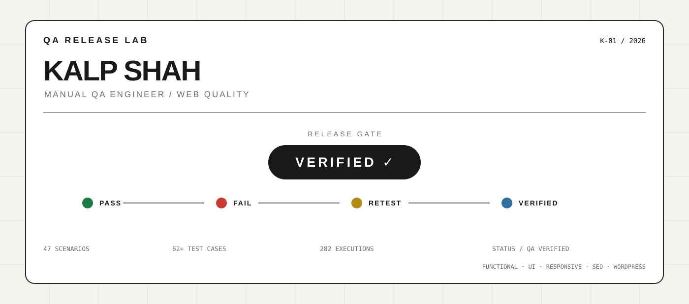

# Kalp Shah — Manual QA Engineer

  

  <strong>Web QA · WordPress · Functional · UI · Responsive · SEO</strong> 
  I test web experiences, find defects, and verify fixes before release.

  <a href="https://kalpshahtester.github.io/">Portfolio</a> ·
  <a href="https://www.linkedin.com/in/kalp-shah-software-tester/">LinkedIn</a> ·
  <a href="https://github.com/kalpshahtester/kalpshahtester.github.io/raw/refs/heads/main/Kalp%20Shah%20Manual%20Tester%20Resume.pdf">Resume</a>

---

## QA AT A GLANCE

**Manual QA Engineer** focused on web and WordPress quality.

- Functional and UI testing
- Responsive and cross-browser validation
- WordPress and content QA
- SEO and accessibility checks
- Defect reporting, regression and retesting
- Test cases, RTM, execution results and QA documentation

---

## SELECTED QA CASE STUDIES

### 01 / SauceDemo — Manual Testing

**E-commerce workflow QA**

47 test scenarios · 62+ test cases · 282 execution results

**Coverage:** Login · Products · Cart · Checkout · Negative testing · Regression

**Evidence:** [Test Cases](https://github.com/kalpshahtester/Manual-Testing-Project-saucedemo-website/tree/main/04_Test_Cases) · [Bug Reports](https://github.com/kalpshahtester/Manual-Testing-Project-saucedemo-website/tree/main/06_Bug_Report) · [RTM](https://github.com/kalpshahtester/Manual-Testing-Project-saucedemo-website/tree/main/07_RTM)

### 02 / MakeMyTrip — Testing Assessment

**Travel booking workflow QA**

**Coverage:** Login · Registration · Hotel booking · Flight booking · Validation · Negative testing

[View project →](https://github.com/kalpshahtester/MakeMyTrip-Testing-Assessment)

### 03 / WordPress Web QA

**Real-world website quality checks**

**Coverage:** Pages · Blogs · Forms · UI · Responsive layouts · Links · Content · SEO · Regression

---

## MY QA PROCESS

  <strong>TEST → FIND → REPRODUCE → REPORT → FIX → RETEST → VERIFY</strong>

I focus on reproducible defects, clear evidence, impacted-area regression, and verification after fixes.

---

## TOOLS

**QA:** Manual Testing · Test Cases · Bug Reporting · RTM · Regression · Retesting

**Web:** WordPress · Chrome DevTools · Lighthouse · Responsive Testing

**Workflow:** ClickUp · Slack · Google Sheets · GitHub

**Quality:** SEO · Accessibility Checks · Broken Links · Content Validation · Performance Checks

---

## EXPERIENCE

**Manual QA Engineer**

Web and WordPress testing focused on functional quality, UI consistency, responsive behavior, SEO validation, defect verification and release confidence.

---

## EDUCATION

**Diploma in Information Technology**  
Dr. S. & S. S. Gandhi College of Engineering & Technology

---

## LET'S CONNECT

  <a href="https://kalpshahtester.github.io/">Portfolio</a> ·
  <a href="https://www.linkedin.com/in/kalp-shah-software-tester/">LinkedIn</a> ·
  <a href="https://github.com/kalpshahtester">GitHub</a> ·
  <a href="https://github.com/kalpshahtester/kalpshahtester.github.io/raw/refs/heads/main/Kalp%20Shah%20Manual%20Tester%20Resume.pdf">Resume</a>

  Manual QA Engineer · Web QA · WordPress QA · SEO QA

